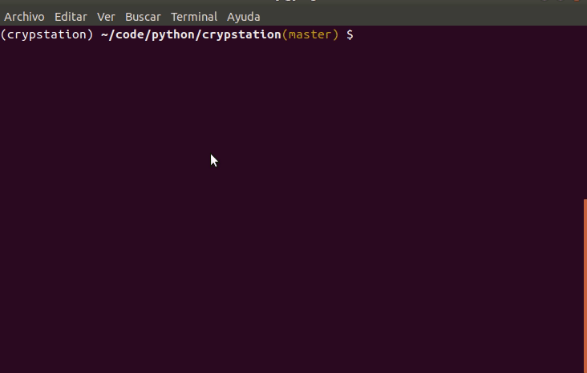

# Crypstation

## Project Goal
The goal is to have an easy station that allow trading cryptocurrencies in multiple platforms.

## Roadmap

~~1. Build commands that allowe the initial setup of exchange and donwload data of OHLCV in multiple exchanges, 
for backtestings.~~

2. Web Panel for setup user account in exchange, and execute order from crypstation.

3. Setup architecture PUB/SUB for execute events from signals of strategies.